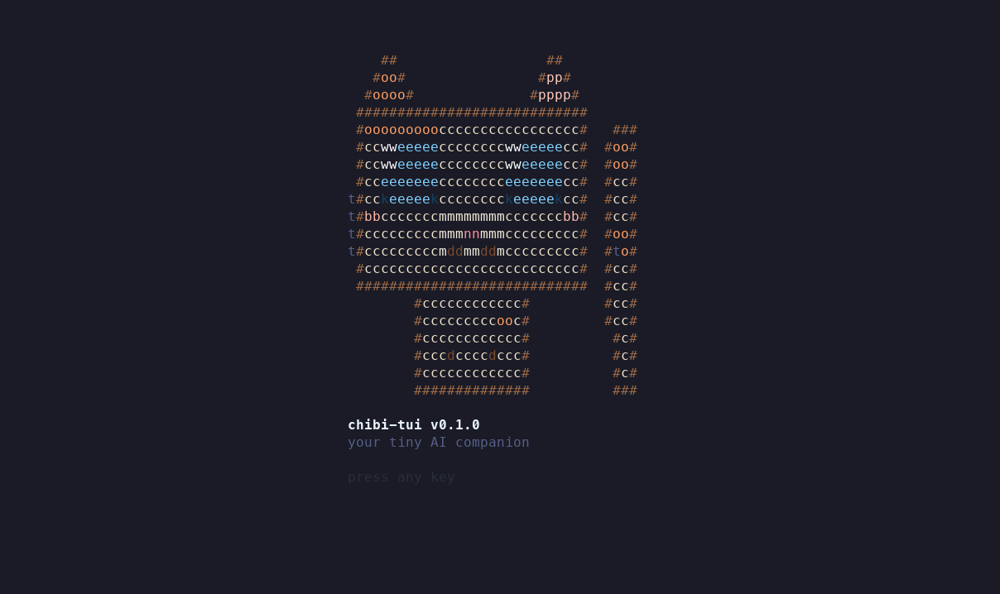
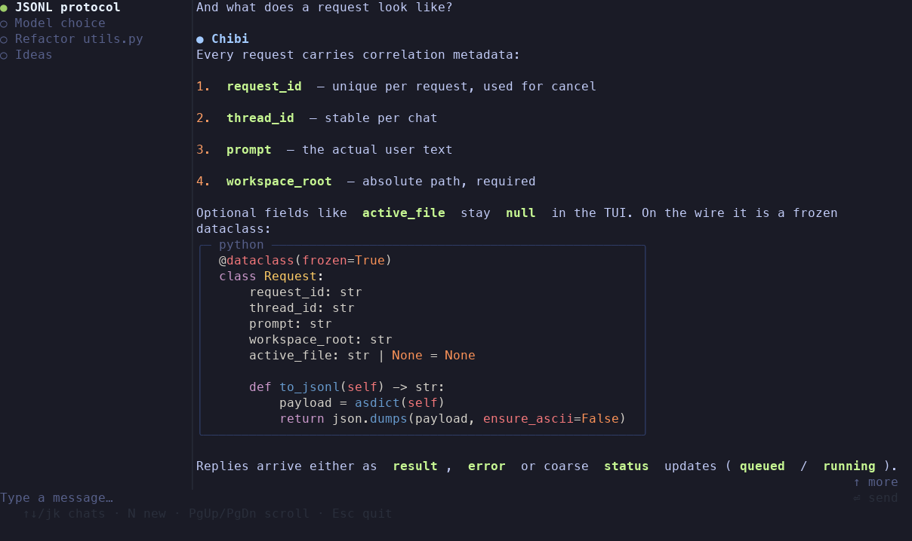

<h1 align="center"></h1>

# chibi-tui

<p align="center">
  <a href="https://github.com/s-nagaev/chibi-tui/actions/workflows/ci.yml"></a>
  <a href="https://www.codefactor.io/repository/github/s-nagaev/chibi"></a>
  <a href="https://hub.docker.com/r/pysergio/chibi"></a>
  <a href="https://pypi.org/project/chibi-bot/"></a>  
  <a href="https://hub.docker.com/r/pysergio/chibi/tags"></a>
  <a href="https://github.com/s-nagaev/chibi/blob/main/LICENSE"></a>
  <a href="https://chibi.bot"></a>
</p>

A terminal UI client for [Chibi](https://github.com/s-nagaev/chibi) — an AI
assistant — built with Rust + ratatui + crossterm + tokio. Chats with the
assistant over IDE protocol v1 (JSONL over stdio), renders markdown answers
with syntax-highlighted code blocks, and persists chat history locally.

| Splash | Chat |
|---|---|
|  |  |

More screenshots: [spinner](docs/02_spinner.png) ·
[answer](docs/03_answer.png) · [other chat](docs/04_other_chat.png).

## Requirements

- A terminal with 24-bit color support.
- The `chibi` binary in `PATH` (the TUI spawns it as `chibi stdio --tui`).
- For building: a Rust toolchain (edition 2021).

## Installation

### Prebuilt binaries

Grab an archive from the
[GitHub Releases](https://github.com/s-nagaev/chibi-tui/releases) page — every
release ships a binary per platform plus a `SHA256SUMS.txt` with the
checksums of all archives:

| Platform | Archive |
|---|---|
| Linux x86_64 | `chibi-tui-<version>-x86_64-unknown-linux-gnu.tar.gz` |
| macOS Apple Silicon | `chibi-tui-<version>-aarch64-apple-darwin.tar.gz` |
| macOS Intel | `chibi-tui-<version>-x86_64-apple-darwin.tar.gz` |
| Windows x86_64 | `chibi-tui-<version>-x86_64-pc-windows-msvc.zip` |

Download the archive matching your platform and `SHA256SUMS.txt`, verify the
checksum (`sha256sum -c` on Linux / `shasum -a 256 -c` on macOS / `Get-FileHash`
in PowerShell), extract the archive (`tar -xzf` / `unzip`) and put the
`chibi-tui` binary somewhere on your `PATH`.

### From crates.io

```bash
cargo install chibi-tui
```

(available on crates.io after the first release — until then, use a prebuilt
binary or build from source).

### Backend

The TUI is a client: it spawns the `chibi` binary from the
[`chibi-bot`](https://pypi.org/project/chibi-bot/) Python package and talks
IDE protocol v1 over stdio:

```bash
pip install chibi-bot
```

The default transport spawns `chibi stdio --tui`; the workspace root travels
inside each request frame (your `--workspace` value, the current directory by
default), never on the backend command line. To point the TUI at a custom
backend executable instead of the `chibi` found on `PATH`, set
`CHIBI_BACKEND_BIN=/path/to/backend`.

### Build from source

```bash
git clone https://github.com/s-nagaev/chibi-tui chibi-tui && cd chibi-tui
cargo build --release
# binary at target/release/chibi-tui
```

## Usage

```bash
chibi-tui --workspace /path/to/project   # live mode: talks to `chibi stdio --tui`
chibi-tui --mock                         # demo mode: static mocks, no backend needed
```

Options:

| Flag | Meaning |
|---|---|
| `--workspace <dir>` | Workspace root passed to the backend (default: current dir). |
| `--mock` | Run fully on mocks — no backend process, no I/O; development/screenshot mode. |
| `--history-dir <dir>` | Override the chat-history directory. |

The app starts in fullscreen alternate-screen mode; the terminal is restored on exit.

### Model label

When the backend reports which model produced an answer (the protocol `result`
frame carries optional `model`/`provider` fields), the assistant's header line
shows it next to the agent name in a dim parenthetical:

```
● Chibi (glm-5.2)
```

If both fields are present the short `model` display name wins; a
`provider`-only answer labels itself with the provider. The label is attached
per message at answer time, so two consecutive replies from different models
are each labeled with their own.

The parenthetical is **absent** — a plain `● Chibi` — when the answer carries
no model information: an older backend, a `result` frame without the optional
fields, or messages saved before labels were persisted. The label is stored
per message in the history file (an optional `model` key, additive and
backward-compatible), so each restored answer keeps the model that actually
produced it: switching the model mid-chat never re-labels past answers, and
the thread's current model is only shown by the status strip / panel readout.

### Behavior notes

Empty agent acknowledgements are hidden; the spinner is the signal that work
continues. When an agent answers with nothing (or only the protocol-level
`<chibi>ACK</chibi>` marker), no assistant bubble appears at all — the pending
spinner simply resolves and the next queued prompt (if any) sends immediately.
An answer that merely *contains* the marker next to real text is shown as-is,
raw; cleaning up partial markers is the backend's job, not the TUI's.

## Keybindings

| Key | Action |
|---|---|
| `Ctrl+↑` / `Ctrl+↓` | Switch to the previous / next thread (the chat scroll resets on every switch; on stock macOS use `Alt+↑` / `Alt+↓` instead — see the macOS note below) |
| `Ctrl+T` | Toggle keyboard focus between the Chat pane (the prompt editor, default) and the Sidebar (the thread list) — while the Sidebar holds focus, `↑`/`↓` move the thread selection with live switching, `Enter`/`Esc` return to the editor with the draft untouched, and `PgUp`/`PgDn` keep scrolling the chat |
| `↑` / `↓` | Move the text cursor up/down inside the multi-line input (they move the thread selection instead while the Sidebar holds focus) |
| `Ctrl+N` | Start a new chat |
| `Ctrl+P` | Clone the current thread with its full conversation context as a `<name> (copy)` thread (refused while the thread is busy; on older backends a popup explains instead) |
| `Ctrl+R` | Rename the current thread inline (`Enter` saves, `Esc` cancels) |
| `Ctrl+D` | Delete the current thread after confirmation (`Enter`/`y` confirm, `Esc`/`n` cancel; refused while the thread is busy) |
| `Ctrl+F` | Find text in the current thread: type to filter, `↑`/`↓` navigate matches, `Enter` jump to a match, `Esc` close |
| `Ctrl+Shift+F` | Find text across all threads; `Enter` switches to the match's thread and jumps to the match (requires the kitty keyboard protocol) |
| `Ctrl+G` | Open the diagnostics log viewer (`PgUp`/`PgDn` or `↑`/`↓` scroll, `Esc` close) |
| `Ctrl+O` | Toggle the status strip — a dim `cwd: <workspace> · <model>` readout on the chat header's top border, extended with a `· ctx …` context-usage segment once the backend reports one (hidden by default) |
| `Ctrl+S` | Toggle the dim reasoning (thoughts) block above the latest answer (on by default; a session-only view state — nothing is ever removed from saved history) |
| `Ctrl+M` | Open the model picker popup (`↑`/`↓` navigate, `Enter` switch, `Esc` close; requires the kitty keyboard protocol) |
| `Enter` | Send the message (or queue it while this chat is busy) |
| `Shift+Enter` / `Alt+Enter` | Insert a newline into the input (multi-line prompts) |
| `Ctrl+C` | Cancel the in-flight request of the current chat; quit when idle |
| `PgUp` / `PgDn` | Scroll the chat view up/down one page (on macOS laptops without Page keys, `fn`+`↑` / `fn`+`↓` are equivalent) |
| `Esc` | Clear the input or dismiss a popup; while the Sidebar holds focus, it just returns focus to Chat without touching the draft |
| `Ctrl+V` | Paste from the clipboard (macOS: Cmd+V) |
| `Ctrl+A` / `Ctrl+E` | Move the cursor to the start / end of the line |
| `Ctrl+U` | Delete from the cursor to the start of the line |
| `Ctrl+L` | Stop the running request of the current chat behind a confirmation popup (`Enter`/`y` confirm, `Esc`/`n` cancel; a no-op when idle; on backends without `/stop` support a toast explains instead) |
| `Shift+Ctrl+L` | Reset the current thread behind a confirmation popup (same confirm/cancel keys): the thread's history is dropped and the local dialog cleared, both while running and when idle (on legacy terminals this degrades to `Ctrl+L` — type `/reset` at the prompt instead) |
| `F1` | Toggle the keybindings help modal — a centered, scrollable popup listing every active chord |

> **Terminal support:** `Shift+Enter` / `Alt+Enter`, `Ctrl+↑` / `Ctrl+↓`,
> `Alt+↑` / `Alt+↓`, `Ctrl+Shift+F`, `Shift+Ctrl+L` and `Ctrl+M` require a
> terminal that implements the
> [kitty keyboard protocol](https://sw.kovidgoyal.net/kitty/keyboard-protocol/)
> (kitty, WezTerm, foot, recent Ghostty, iTerm2, …); chibi-tui requests the
> protocol at startup, and on terminals without support the request is
> silently ignored: `Shift+Enter` / `Alt+Enter` degrade to plain `Enter`
> (sending the message), the thread-switching chords may arrive as plain
> arrows or an Esc + arrow pair and then just move the cursor,
> `Ctrl+Shift+F` degrades to `Ctrl+F`, `Shift+Ctrl+L` to `Ctrl+L`, and
> `Ctrl+M` arrives as bare `Enter`.

> **macOS:** the system binds `Ctrl+↑` / `Ctrl+↓` to Mission Control's
> *Move between spaces*, so prefer the `Alt+↑` / `Alt+↓` variant there (in
> Terminal.app, enable **Use Option as Meta Key** under *Settings → Profiles
> → Keys* so Option reaches the app), or uncheck *Move left / right a space*
> under **System Settings → Keyboard → Keyboard Shortcuts → Mission Control**
> to keep using the Ctrl chords.

### Renaming threads

`Ctrl+R` turns the bottom input line into a single-line editor prefilled with
the current thread title (`✎ Rename thread…`). `Enter` saves the trimmed name
(empty names are rejected and keep the old title), `Esc` cancels and restores
the untouched message draft. Renaming works while a request is running; the
sidebar, header and persisted history update immediately (files are keyed by
thread id, so a rename never orphans a history snapshot).

While renaming, `Shift+Enter` / `Alt+Enter` insert a literal newline into the
draft (multi-line titles render as one space-separated line in the sidebar).
Every Enter press inside the rename editor belongs to the editor — it never
submits the message prompt.

### Deleting threads

`Ctrl+D` opens a centered confirmation popup for the current thread
(`Delete thread`). `Enter` or `y` confirms, `Esc` or `n` cancels, `Ctrl+C`
quits without deleting. While the popup is open, all other keys are ignored —
nothing leaks into the message draft and no global binding fires.

Only **idle** threads can be deleted: if the current thread has a request in
flight or prompts queued, `Ctrl+D` refuses with a brief status message
(`can't delete — busy`) and no popup appears. Deleting an idle thread while
another thread runs in the background is fine — the background request is
untouched. On confirm the thread is removed from the list and its persisted
history file is deleted (a missing file is treated as success). The **next**
thread is selected, or the **previous** one when the last was deleted, or the
clean empty state when no threads remain; the chat view returns to
follow-bottom. Terminal events arriving later for a removed thread are dropped
silently.

### Finding text in a thread

`Ctrl+F` opens a centered search popup scoped to the current thread. Type to
filter: matches are recomputed live, case-insensitively, over the rendered
message text (markdown markup like `**` or backticks is never matched). Each
match is listed as `role · snippet` with a short context window around the
hit, and the total count is shown in the popup title.

`↑` / `↓` move the selection, `Enter` jumps the chat view to the selected
match (the wrapped row containing the hit is placed near the top of the
pane — accurate even for long, visually-wrapped paragraphs) and closes the
popup, `Esc` closes without moving the view, `Ctrl+C` quits. While the popup
is open, all other keys are ignored — the message draft is never touched and
no global binding fires. Searching is strictly read-only and works even while
the thread is busy with a request; `PgUp`/`PgDn` scrolling is suspended while
the popup is open (the jump drives the view instead).

### Finding text everywhere

`Ctrl+Shift+F` opens the same popup family scoped to **all** threads: matches
from every chat are combined — ordered by chat, then by message within each
chat — and each entry is labeled with its **thread title** before the role
label and snippet. The popup title shows the total match count and the number
of threads searched.

`↑` / `↓` move the selection, `Enter` **switches to the match's thread** (the
same selection mechanics as `Ctrl+↑` / `Ctrl+↓` — and `Alt+↑` / `Alt+↓`) and
jumps the chat view to the selected match — the wrapped row containing the
hit is placed near the top of the pane, accurate even for long,
visually-wrapped paragraphs — then closes the popup. `Esc` closes without
switching or jumping, `Ctrl+C` quits.
Like the in-thread search, it is strictly read-only, works while threads are
busy, and all other keys are ignored while the popup is open.

`Ctrl+Shift+F` needs the kitty keyboard protocol (see the terminal support
note above): on terminals without it the Shift modifier is lost and the chord
degrades to plain `Ctrl+F` (in-thread search).

If the backend fails to connect or drops mid-session, a modal error popup
appears instead of crashing; `R` retries, `Esc` dismisses, `q` or `Ctrl+C` quits.

### Diagnostics log

chibi-tui keeps the last **512 lines** of diagnostics in memory and shows them
in a modal viewer opened with **`Ctrl+G`** (also works while the Sidebar pane
holds focus):

- **What lands in the log** — everything the backend prints to its **stderr**
  (lines appended verbatim; timestamps come from the backend itself), plus
  TUI-side lifecycle events stamped with a `[tui]` prefix in the same stream:
  backend spawn, handshake ok/fail, reconnect, pipe closed. One unified
  diagnostic stream.
- **Reading it** — the viewer opens live-tailing at the bottom; new lines
  stream in while you sit there. `PgUp`/`PgDn` (or `↑`/`↓`) scroll; scrolling
  up freezes the view and a `+K new lines` footer counts what arrived while
  you were detached — page back down to re-arm the tail. `Esc` closes. When
  unseen lines arrived while the viewer was closed, a dim `log*` token shows
  on the status line.
- **File sink (opt-in)** — set `CHIBI_TUI_LOG=/path/to/file.log` before
  starting and every line that lands in the ring buffer is mirrored to that
  file (append mode; parent directories are created). Unset (the default)
  means memory only. A file that cannot be opened/created is silently
  ignored — diagnostics never break the app.
- **Known limitation** — only the backend's **stderr** reaches the buffer.
  The backend's own logging currently writes to its **stdout** (the
  protocol channel), so backend log lines do not appear here.

### Status strip

A hideable one-row readout on the **chat header's top border**, toggled with
**`Ctrl+O`** (also works while the Sidebar pane holds focus). **Hidden by
default**; the toggle state is plain view state — it survives every modal
open/close and never captures keys.

- **Content**: `cwd: <workspace> · <model>`; when the backend reports
  usage, a trailing `· ctx …` context-usage segment is appended (see
  **Context usage** below):
  - `cwd` is the **basename of the workspace root** (the `--workspace` value
    the TUI passes to the backend; CLI-only today, read reactively so a
    future runtime change would show up on the next frame).
  - `model` is the **last known model of the active chat**, reusing the same
    per-message metadata as the `● Chibi (model)` answer headers: it updates
    on every result resolution, an error resolution keeps the last known
    label, and switching chats re-labels from that chat's own history. A
    model switch made in the picker updates it too — without a transcript
    bubble (see the Model picker section). Both
    segments render a `—` placeholder when unknown. Model labels persist per
    message, so a restored chat re-labels the strip from its own newest
    answer (until the next switch or turn updates it).
- **Placement** — the strip rides the SAME top-border row as the chat title
  (`#1/4 · JSONL protocol`), right-aligned: it costs **zero vertical space**.
  On narrow terminals it is truncated with an ellipsis to the space left of
  the title, and in a too-narrow chat pane it simply does not render.
- **Styling** — dim (theme-driven), deliberately quiet: context, not content.
- **Context usage**: when a `result` frame carries the optional `usage`
  object, the readout gains a trailing `· ctx 14% (18.4k/131.0k)` segment:
  a floored percent of input tokens against the backend-reported context
  window, both counts humanized (raw digits under 1000, `x.xk` under a
  million, `x.xM` beyond; tenths are truncated, never rounded up). An
  unknown or zero window falls back to the absolute count alone
  (`· ctx 18.4k`), never an invented maximum. The segment is omitted
  byte-for-byte until the first result reports usage, and it updates only
  when a new result frame resolves: it shows the latest turn's numbers,
  not a running estimate.

### Reasoning display (thoughts)

When the backend's `result` frame carries the optional `thoughts` field (the
model's raw reasoning trace), chibi-tui renders it as a dim block ABOVE the
latest answer of the chat that produced it. The block is static text: it
appears together with the answer, there is no streaming. Traces longer than
64 KB arrive already truncated by the backend, with a visible
`[... LLM reasoning truncated: 64 KB limit reached ...]` marker at the end.

The trace belongs to its thread: a background reply updates its own chat
only, hidden model-picker exchanges and command answers never wipe it, and
switching threads shows the entered chat's own trace — never another chat's.
A new request in a chat clears that chat's block until its next answer.
`Ctrl+S` toggles the block for the session, on by default; the status hints
row carries a `^S on/off` token so the state is always visible. Flipping the
toggle never discards anything, and reasoning is never saved to the history
file: a restart restores messages only, without traces. Answers without
reasoning, whitespace-only traces, or the toggle off render exactly as they
did before the feature existed.

These features are optional: chibi-tui announces support for thoughts and
subagent progress when connecting, and older backends simply ignore the
announcement.

### Subagent counter

While the active chat has a request in flight and the backend reports live
subagent progress, the spinner line above the input gains a trailing
`· subagents working: n` segment (n = currently active subagents). The
segment follows the active chat only: background chats keep showing their
work in the sidebar dot, and without live subagents the spinner line is
byte-for-byte unchanged.

### Model picker

A centered modal popup opened with **`Ctrl+M`** (also works while the Sidebar
pane holds focus) that switches the backend's model WITHOUT any protocol
support — it reuses the plain chat pipeline:

1. Opening sends a bare `/model` request and renders the popup with a
   `loading models…` placeholder while the answer travels.
2. The textual listing (`N. name (provider)` rows) is parsed from the
   answer; the popup lists every row with the backend's 🟢 active-model
   marker re-styled, and best-effort preselects the chat's last known model
   (ambiguous or unknown labels start at the first row). The list scrolls
   when it exceeds the viewport; the selection auto-scrolls into view.
3. `Enter` sends `/model <n>` for the highlighted row's own listing number;
   the backend's confirmation arrives as a compact status toast
   (`model: <name> (provider)`), not as a chat bubble. The switch also
   updates the chat's last-known model — the status strip (`Ctrl+O`) picks
   it up on the next frame.

**Disclosure — hidden exchanges:** both the `/model` fetch and the
`/model <n>` selection are *suppressed from the transcript* (they are
plumbing, not conversation): no user/assistant bubbles are ever added.
Feedback comes as toasts. A failed or unparsable listing degrades honestly:
an info toast (`model list unavailable`) appears AND the raw `/model`
exchange is added to the transcript as a normal visible chat exchange, so
you always see what actually happened. Errors follow the standard error
popup path (with the `R` reconnect escape).

**Busy rules:** the picker popup can open anytime, but the hidden requests
obey the same per-thread busy/queue rules as any prompt — while the chat is
busy the fetch (or a confirmed selection) waits invisibly and is sent on the
next idle drain. `Esc` drops a not-yet-sent fetch; a confirmed selection
survives closing the popup.

**Chord caveat:** the kitty keyboard protocol (pushed at startup) makes
`Ctrl+M` a distinct event from `Enter`. On legacy terminals without it,
`Ctrl+M` arrives as bare `Enter` — with a non-empty draft that submits the
draft (same degradation class as `⇧↵`); the picker chord requires a
kitty-capable terminal (as noted in the keybinding table).

## Configuration & Data

Chat history is stored locally under the platform data directory:

```
~/.local/share/chibi-tui/threads/     # Linux (XDG data dir)
~/Library/Application Support/chibi-tui/threads/  # macOS
%APPDATA%\chibi-tui\threads\          # Windows
```

Each chat is saved as `<chat-id>.json` and restored on startup. Corrupt files
are skipped rather than blocking startup. Override with `CHIBI_TUI_HOME` or
`--history-dir`.

Diagnostics file sink: set `CHIBI_TUI_LOG` to a path to mirror the in-memory
diagnostic stream (backend stderr + `[tui]` lifecycle events, see the
Diagnostics section) to a file. Unset by default.

No other configuration files, no network access beyond what the spawned
backend performs.

## Architecture

```
src/
├── main.rs             tokio event loop: keyboard / backend events / spinner tick
├── lib.rs              library root; all testable logic lives here
├── protocol.rs         serde types of IDE protocol v1
├── backend_client.rs   child-process lifecycle: spawn, handshake, JSONL framing
├── request_pipeline.rs request correlation, cancellation, status updates
├── live.rs             LiveBackend: real backend source
├── backend.rs          Backend trait + MockBackend (latency + canned replies)
├── history.rs          local persistence (<data>/chibi-tui/threads/)
├── app.rs              state: chats, selection, input buffer, connection
├── markdown.rs         pulldown-cmark → styled ratatui lines (+ syntect)
├── mock.rs             static mock conversations and reply set
├── model.rs            Message / Role / ChatStatus types
├── popup.rs            modal popups (errors)
├── splash.rs           ASCII kitten splash screen (~1.5s, skippable)
├── theme.rs            Tokyo Night palette
└── ui.rs               layout: sidebar + chat view + input + status line
```

Both backend sources surface progress as `BackendEvent` streams, so the UI is
agnostic to which one is wired in — replacing mocks with another transport
requires only a new `Backend` implementation.

## Development

```bash
cargo fmt --check                              # formatting
cargo clippy --all-targets -- -D warnings      # lints
cargo test                                     # unit + fixture + integration tests
cargo doc --no-deps                            # API docs
```

CI runs fmt, clippy (-D warnings), tests and a release build on stable and beta.

## Release process

Releases are tag-driven: bump the version, tag it, create a GitHub Release —
[.github/workflows/release.yml](.github/workflows/release.yml) does the rest
(per-platform binary archives + `SHA256SUMS.txt` attached to the release, then
the crate published to crates.io).

1. Bump `version` in `Cargo.toml` and commit. The tag and the manifest version
   must match exactly — the publish job hard-fails on tag/manifest drift.
2. Tag the commit and push it: `git tag vX.Y.Z && git push origin vX.Y.Z`.
3. Create a GitHub Release from that tag. The `release: published` event
   triggers the workflow: the four binary legs build and attach their archives,
   and the `publish` job runs once they all succeed.

Prerequisites:

- `CARGO_REGISTRY_TOKEN` present in the repository's Actions secrets (the
  publish job only ever passes it to cargo via the environment — never argv,
  never logs).
- `main` CI green is the norm, but the publish job re-runs `cargo test
  --locked` on the tagged commit anyway — the quality gates in `ci.yml` may
  not have run for that exact commit.

The publish job is idempotent: if the tag's version is already on crates.io
it prints `already published, skipping` and exits 0 instead of failing on the
re-upload. A manual `workflow_dispatch` run builds artifacts only — it never
publishes.

Emergency local publish (rarely needed; prefer CI):

```bash
CARGO_REGISTRY_TOKEN=<token> cargo publish --locked
```

## License

MIT — see [LICENSE](LICENSE).
